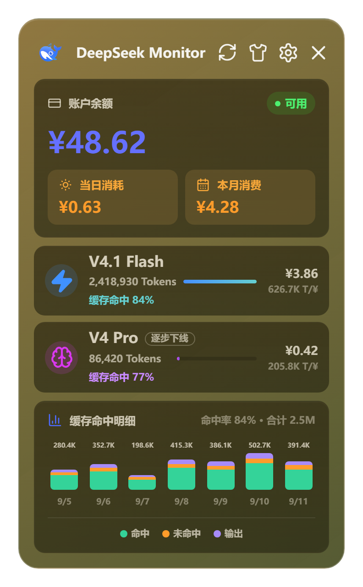
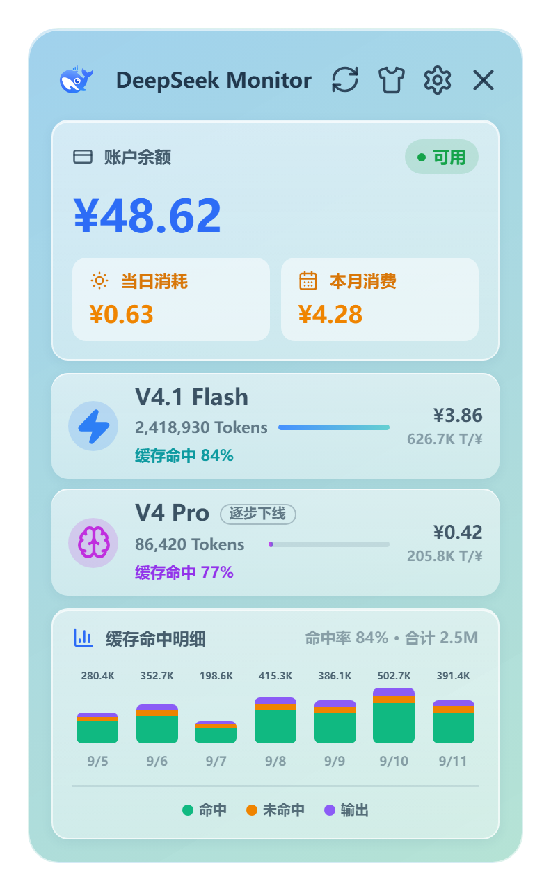

# DeepSeek Monitor Windows

把 DeepSeek 的余额和用量钉在 Windows 托盘上的小面板。点一下图标，就能看到还剩多少钱、今天花了多少、这个月花了多少，以及每个模型的 Token 和缓存命中情况。

只面向 Windows 10 / 11，技术栈是 Tauri 2 + React 18 + Rust。

**本项目不是 DeepSeek 官方产品，与 DeepSeek 公司无关。**

## 界面

| 深色皮肤 | 浅色皮肤 |
| :---: | :---: |
|  |  |

*上图均为演示数据，非真实账户。*

## 为什么会有这个项目

DeepSeek 官方只开放了余额接口，没有账户级的用量接口。网页端的用量页虽然能看到消费，但看不到「缓存命中 / 缓存未命中 / 输出」这种按模型拆开的明细，也没办法常驻桌面随时瞄一眼。

这个项目把三件事拼在一起：

- **余额** —— 用官方 API Key 直接调 `/user/balance`。
- **用量** —— 复用网页登录态换来的用量 Token，调平台内部接口，拿到当月消费、Token 总量、请求数和缓存明细。
- **呈现** —— 合并成一个常驻托盘、不占任务栏的窄面板，随开随关。

## 安装与上手

### 安装

从 [Releases](https://github.com/Tsuki-hash/DeepSeek-Monitor-Windows/releases/latest) 下载 `DeepSeekMonitorWindows_1.2.1_x64-setup.exe` 安装。覆盖安装不需要先卸载旧版本。

运行环境：Windows 10 或 Windows 11，以及 Microsoft Edge WebView2 Runtime（Windows 11 自带，Windows 10 若缺失需单独安装）。

### 填 API Key

打开主面板 → 右上角设置 → 「API Key」区块，粘贴你的 Key（在 DeepSeek 开放平台的 API Keys 页面生成），点 **验证并保存**。验证通过后，设置页会直接显示当前余额，主面板也会开始刷新。

### 同步用量

用量要用另一个凭据，见「两种凭据，别混」一节。

### 日常使用

- 点窗口右上角的关闭按钮 = **隐藏到托盘**，不是退出。
- 左键托盘图标：显示 / 隐藏面板。
- 右键托盘图标：显示主面板 / 退出。

## 两种凭据，别混

这是最容易踩的坑：查余额和查用量用的**不是**同一个东西。

|  | API Key | 用量 Token |
| --- | --- | --- |
| 从哪里来 | DeepSeek 开放平台 → API Keys 页面 | 登录 platform.deepseek.com 之后的会话 token |
| 用来干什么 | 查账户余额 | 查用量与消费 |
| 能不能互换 | 不能 | 不能 |

**为什么用量非得用 Token**：DeepSeek 没有公开账户级用量接口，只能复用网页端自己在调的那套接口，因此必须借你的登录态。这个 Token 属于会话凭据，和 API Key 一样敏感，而且会过期。

### 方式一：网页登录自动同步

在设置页「用量同步 Token」区块点 **网页登录自动同步**，在弹出的 DeepSeek 登录窗口完成登录。

应用会 hook 页面发出的网络请求，直接从 `Authorization` 头里抓取 Bearer token，验证它确实能调通用量接口之后才保存，然后自动刷新数据。

> 登录需要时间，页面登录完成后才会发请求。如果点了没反应，把登录窗口关掉再点一次按钮即可（等待期间按钮显示「等待登录」）。

### 方式二：手动粘贴（兜底）

点 **方式二：手动粘贴 token** 展开。用浏览器登录 platform.deepseek.com，按 F12 打开控制台，输入：

```js
JSON.parse(localStorage.userToken).value
```

复制返回的字符串，粘进输入框，点 **保存 Token**。

**用量 Token 会过期。查不出用量时，重新同步一次就行。**

## 模型口径

DeepSeek 在 2026-09-10 上线了 V4.1 Flash，模型名从 `deepseek-v4-flash` 改为 `deepseek-flash`。这次变更有个坑：**旧模型名没有被立刻禁用，而是被兼容路由到了新模型**，所以迁移期内同一份账单里可能出现新旧两种名字。本项目的处理方式：

| 平台返回的 model | 归入界面上的哪一行 |
| --- | --- |
| `deepseek-flash` | V4.1 Flash |
| `deepseek-v4-flash` | V4.1 Flash（**累加**） |
| `deepseek-v4-flash-vision-exp` | V4.1 Flash（**累加**） |
| `deepseek-v4-pro` | V4 Pro |

同名归入同一行时是**求和**而不是覆盖——否则一旦新旧名字并存，会有一部分用量被静默丢掉，界面上还看不出来。

另外两件事值得知道：

- **V4 Pro 正在下线。** 从北京时间 2026-09-14 12:00 起，所有 `deepseek-v4-pro` 请求都会被路由到 V4.1 Flash 并按 Flash 单价计费，直到 V4.1 Pro 上线。界面保留 Pro 行并标注「逐步下线」，历史数据仍然看得到。
- **未归类的 Token 有兜底统计。** V4.1 Flash 原生支持图片输入，如果平台返回了本项目尚未分类的 token 类型，这些量会被计入总量，并在图表里以「其他（未归类）」单独显示，而不是静默丢掉。

## 界面上的数字分别是什么

### 主面板

| 位置 | 含义 |
| --- | --- |
| 账户余额 | 官方 `/user/balance` 返回的总额度，含赠送额度与充值额度 |
| 当日消耗 / 本月消费 | 来自平台用量接口的费用字段 |
| 模型行 | 该模型当月的 Token 总量、费用，以及每元能买多少 Token（T/¥）；下方是缓存命中率 |
| 缓存命中明细 | 最近 7 天的按日堆叠柱状图，三段分别是输入（命中缓存）、输入（未命中缓存）、输出 |

### 详情页

点主面板上任一模型行进入。展示该模型的请求次数、Token 总量，以及按日的 Token 消耗分解。

### 设置页

API Key 与用量 Token 的配置和清除、开机自启、自动刷新间隔（1 分钟 / 5 分钟 / 30 分钟 / 1 小时）、当前版本号。

## 凭据存在哪里

```text
%APPDATA%\DeepSeekMonitorWindows\config.json
```

API Key 和用量 Token 都以**明文**存在这个文件里，没有加密。因此：

- 不要把它提交到任何仓库，不要分享，也不要备份到云盘。
- 不要在截图、日志或配置文件里暴露里面的内容。
- 在共享电脑上用完，去设置页点 **清除 Key** 和 **清除 Token**。

网页登录产生的 WebView2 缓存位于 `%LOCALAPPDATA%\com.deepseek.monitor.windows\EBWebView`，属于本机运行数据，同样不应提交到仓库。

## 开发

### 环境要求

- Node.js 18+ 与 npm
- Rust 1.77.2+，建议 MSVC 工具链
- Visual Studio Build Tools 2022，勾选 `Desktop development with C++`

`npm run tauri:dev` 和 `npm run tauri:check` 会自动探测本机 VS Build Tools 的位置，不需要手动配路径。

### 常用命令

```powershell
git clone https://github.com/Tsuki-hash/DeepSeek-Monitor-Windows.git
cd DeepSeek-Monitor-Windows
npm install
npm run tauri:dev
```

```powershell
npm run tauri:check   # 环境与依赖检查
npx tauri build       # 打包 NSIS 安装包
```

安装包产物位于 `src-tauri/target/release/bundle/nsis/`。若报 `Visual Studio Build Tools not found`，请安装 Build Tools 2022 并确认勾选了 C++ 组件。

### 代码结构

```text
DeepSeek-Monitor-Windows/
├── src/                         # 前端
│   ├── main.tsx                 # 全部界面：主面板、设置页、详情页
│   └── styles.css               # 全部样式，含深色 / 浅色两套皮肤
├── src-tauri/                   # 后端
│   ├── src/lib.rs               # 全部命令：API 调用、配置读写、托盘、登录态同步
│   ├── tauri.conf.json          # 窗口、打包与安全配置
│   └── capabilities/            # Tauri 权限
├── public/assets/               # 图标与静态资源
├── scripts/                     # Windows 开发脚本
└── screenshots/                 # README 界面截图
```

界面是一个单文件（`main.tsx` + `styles.css`），后端也是一个单文件（`lib.rs`）。模型名到界面行的映射集中在 `lib.rs` 的 `model_slot()`，改模型或加模型从那里入手。

## 常见问题

**余额能查到，但用量一直是空的？**
两者用的是不同凭据。余额看 API Key，用量看用量 Token——先确认用量 Token 已经配好了。

**提示「用量不可用」或「未配置用量 Token」？**
用量 Token 过期了。去设置页重新点一次 **网页登录自动同步**，或按方式二手动粘贴。

**登录窗口点了没反应 / 一直显示「等待登录」？**
登录本身需要时间，登录完成后页面才会发请求、token 才会被捕获。如果一直没动静，关掉登录窗口再点一次按钮。

**关掉窗口后程序还在后台？**
这是设计如此——「关闭」是隐藏到托盘。要真正退出，右键托盘图标选「退出」。

**Pro 那一行一直是 ¥0.00？**
V4 Pro 已从 2026-09-14 起全部路由到 V4.1 Flash，不再产生独立用量。这一行会保留，方便你回看历史数据。

**会不会频繁请求 DeepSeek 的接口？**
余额和用量在打开面板、手动刷新、以及你设定的自动刷新周期（默认关闭，开启后最短 1 分钟）时各请求一次，没有后台轮询。

## 版本历史

完整发布记录见 [Releases](https://github.com/Tsuki-hash/DeepSeek-Monitor-Windows/releases)。`v1.0.0` – `v1.1.0` 由 [Joyi-code/DeepSeekMonitorWindows](https://github.com/Joyi-code/DeepSeekMonitorWindows) 发布，本仓库自 `v1.2.1` 起接手维护。

### v1.2.1

- 适配 DeepSeek 2026-09-10 的模型变更：新模型名 `deepseek-flash`（V4.1 Flash），界面名称同步更新。
- 用量统计改为按模型行归并：`deepseek-flash` 与旧名 `deepseek-v4-flash`、`deepseek-v4-flash-vision-exp` 的用量累加到同一行，不再因新旧名字并存而漏统计。
- V4 Pro 标注「逐步下线」。自北京时间 2026-09-14 12:00 起，其请求全部路由至 V4.1 Flash 并按 Flash 单价计费。
- 新增未归类 token 类型的兜底统计，计入总量并在图表中单独展示，避免静默漏算。
- 安装包为 `DeepSeekMonitorWindows_1.2.1_x64-setup.exe`。

### v1.1.0（Joyi-code 发布）

- 支持缓存命中、缓存未命中与输出 Token 的明细显示。
- 增加亮色皮肤，可在主面板一键切换并记住选择。
- 设置页增加当前版本号显示。
- 安装包为 `DeepSeekMonitorWindows_1.1.0_x64-setup.exe`。

### v1.0.1（Joyi-code 发布）

- 修复单实例缺失导致的重复多开问题（感谢抖音粉丝群烛阴兄弟反馈）。此前程序已在运行时再次点击图标会不断启动新进程，现在改为唤出已有面板。通过接入 `tauri-plugin-single-instance` 实现。

### v1.0.0（Joyi-code 发布）

- 首个正式版本：余额查询、平台用量统计、消费趋势、Windows 托盘入口、API Key 与用量 Token 管理。

## 来源与致谢

本项目是 DeepSeek Monitor 系列在 Windows 桌面端的延续，**直接承接自 [Joyi-code/DeepSeekMonitorWindows](https://github.com/Joyi-code/DeepSeekMonitorWindows)**，并沿用更早的 macOS 原项目 [JayHome137/DeepSeekMonitor](https://github.com/JayHome137/DeepSeekMonitor) 的产品思路与视觉方向。

| 代次 | 仓库 | 目标平台 | 核心技术 |
| --- | --- | --- | --- |
| 初代 | [JayHome137/DeepSeekMonitor](https://github.com/JayHome137/DeepSeekMonitor) | macOS 菜单栏与 WidgetKit 桌面小组件 | Swift 5.9+、SwiftUI、AppKit、WidgetKit |
| 二代 | [Joyi-code/DeepSeekMonitorWindows](https://github.com/Joyi-code/DeepSeekMonitorWindows) | Windows 桌面端 | Tauri 2、React、TypeScript、Rust |
| 本项目 | [Tsuki-hash/DeepSeek-Monitor-Windows](https://github.com/Tsuki-hash/DeepSeek-Monitor-Windows) | Windows 桌面端 | 同上，承接二代继续迭代 |

- **感谢 [@JayHome137](https://github.com/JayHome137/DeepSeekMonitor)**：用 Swift、SwiftUI、AppKit 与 WidgetKit 做出了 macOS 版本，确立了「在桌面角落随手看一眼余额与用量」这个产品形态。没有这个原项目，就没有后面所有版本。
- **感谢 [@Joyi-code](https://github.com/Joyi-code/DeepSeekMonitorWindows)**：把这个想法完整移植到 Windows——重建界面与后端，处理托盘驻留、无边框窗口、WebView2 登录态同步等大量平台细节，并把仓库与安装包完整开源。**本项目的代码基线正是来自这个仓库。**

本仓库接手后的主要工作是跟进 DeepSeek 平台的接口与模型变更、修正用量统计口径，并继续维护 Windows 版本的可用性。本项目不重写实现，而是在二代基线上迭代。

## 许可证与免责声明

MIT License，详见 [LICENSE](LICENSE)，与两代上游项目声明的许可证保持一致。

本项目仅用于学习和研究目的。请遵守 DeepSeek 的使用条款，合理使用相关接口，避免频繁请求。

DeepSeek 的平台页面结构、登录状态、WebView2 缓存行为和内部用量接口都可能随时变化，本项目不保证长期可用。**API Key 和用量 Token 属于敏感凭据，使用者需自行承担本机存储、账号安全、网络请求和数据展示带来的风险。**
